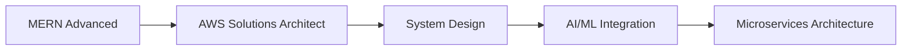

<div align="center">
  
</div>

<h1 align="center">
  
</h1>

<h3 align="center" style="color: #64748b;">
  🎯 Building Innovative Solutions with Modern Tech Stack
</h3>

<p align="center">
  <a href="https://shiv-dev-folio-t2do.vercel.app/">
    
  </a>
  <a href="https://www.linkedin.com/in/shivprasad-dongapure-35760a290/">
    
  </a>
  <a href="mailto:prasaddongapure7660@gmail.com">
    
  </a>
  <a href="https://github.com/Shivprasadpravindongapure">
    
  </a>
</p>

---

## 🚀 About Me

<div align="center">
  
</div>

- 🎓 **Computer Engineering Student** | 📍 Maharashtra, India
- 💻 **Full Stack Developer** specializing in **MERN Stack & Django**
- ☁️ **Cloud Enthusiast** | AWS & Firebase Explorer
- 🧠 **Problem Solver** | DSA + System Design
- 🌍 **Open Source Contributor** | Building for the community

### 🎯 Current Focus
```diff
+ AI/ML Integration in Web Applications
+ Scalable Cloud Architecture
+ Real-time Communication Systems
+ Emergency Response Platforms
```

---

## 🛠️ Tech Arsenal

### 💻 Programming Languages
<div align="center">
  
</div>

### 🎨 Frontend Development
<div align="center">
  
</div>

### ⚙️ Backend Development
<div align="center">
  
</div>

### 🗄️ Databases & Storage
<div align="center">
  
</div>

### ☁️ Cloud & DevOps
<div align="center">
  
</div>

### 🔧 Tools & Technologies
<div align="center">
  
</div>

---

## 🏆 Featured Projects

<div align="center">
  <h3>🚀 Open Source Contributions</h3>
</div>

| 🚀 Project | 📝 Description | 🛠️ Tech Stack | 🔗 Live Demo |
|-----------|---------------|---------------|--------------|
| **💬 Chat App** | Real-time messaging application with WebSocket support | MERN, Socket.io, JWT | [Live](https://chat-app-demo.vercel.app) |
| **⚖️ Nyay AI** | AI-powered legal assistant for document analysis | Django, OpenAI, PostgreSQL | [Live](https://nyay-ai-demo.vercel.app) |
| **🚨 QuickHelpline** | Emergency response platform with real-time alerts | Django, Firebase, Twilio | [Live](https://quickhelpline-demo.vercel.app) |
| **🌐 Shiv Dev Folio** | Modern portfolio with TypeScript animations | Next.js, TypeScript, Tailwind | [Live](https://shiv-dev-folio-t2do.vercel.app) |
| **🧠 Mental Wellness** | AI-driven mental health support platform | React, Node.js, Gemini API | [Live](https://mental-wellness-demo.vercel.app) |

<div align="center">
  <h3>📊 Project Statistics</h3>
  
  
</div>

---

## 📈 GitHub Analytics

<div align="center">
  <h3>🔥 Contribution Streak & Activity</h3>
  
</div>

<div align="center">
  <h3>📊 Contribution Graph</h3>
  
</div>

<div align="center">
  <h3>📈 GitHub Statistics</h3>
  
  
</div>

<div align="center">
  <h3>🏆 GitHub Trophies</h3>
  
</div>

---

## 🌱 Learning Journey

### 🎯 Currently Mastering


### 📚 Recent Certifications
- 🏅 **AWS Cloud Practitioner** (In Progress)
- 🏅 **MongoDB Developer Associate** (Planned)
- 🏅 **React Advanced Patterns** (Completed)

---

## 🤝 Let's Connect!

<div align="center">
  <h3>💬 Let's Build Something Amazing Together!</h3>
  
  [](https://github.com/Shivprasadpravindongapure)
  [](https://twitter.com/shivprasad_dev)
  
  <p>
    <strong>🌐 Portfolio:</strong> <a href="https://shiv-dev-folio-t2do.vercel.app/">shiv-dev-folio-t2do.vercel.app</a><br>
    <strong>💼 LinkedIn:</strong> <a href="https://www.linkedin.com/in/shivprasad-dongapure-35760a290/">Connect with me</a><br>
    <strong>📧 Email:</strong> <a href="mailto:prasaddongapure7660@gmail.com">Get in touch</a><br>
    <strong>🔗 GitHub:</strong> <a href="https://github.com/Shivprasadpravindongapure">Follow my work</a>
  </p>
</div>

---

## 📊 Visitor Count

<div align="center">
  
</div>

---

<div align="center">
  <p style="color: #64748b; font-size: 14px;">
    ⭐ Building innovative & impactful tech solutions for a better future<br>
    Made with ❤️ and lots of ☕
  </p>
</div>

---

<div align="center">
  
</div>
